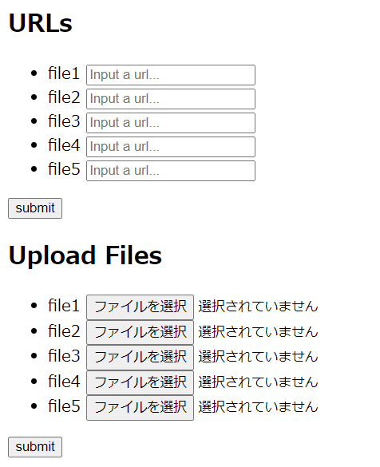

# Photo GPS API

A simple API which returns GPS data of photos from their EXIF data.

## 1. Features

`Photo GPS API` returns GPS data of photos from their EXIF data.

Images can be specified by URLs or by uploading files.

Supported Exif Versions:

- 3.0
- 2.32
- 2.31
- 2.3
- 2.21
- 2.2
- 2.1

## 2. Contents

- [1.Features](#1-features)
- 2\. Contents
- [3. Requirements](#3-requirements)
- [4. Deployment](#4-deployment)
- [5. Limitations](#5-limitations)
- [6. Endpoints](#6-endpoints)
- [7. GPS Attribute Information](#7-gps-attribute-information)
- [8. LICENSE](#8-license)

## 3. Requirements

- PHP 8.2 or later
- GD Library enabled

  check with commands:
  ```bash
  (php -m; php -i) | grep gd
  ```

- EXIF enabled

  check with commands:
  ```bash
  (php -m; php -i) | grep exif
  ```

- [Composer](https://getcomposer.org/)

## 4. Deployment

- Clone this repository to your environment.
- enter the cloned repository.
- Copy `.env.example` to `.env` and edit it as necessary.
- install dependencies:
  ```bash
  composer install
  ```
- Generate the application key:
  ```bash
  php artisan key:generate
  ```
- Run migrations
  ```bash
  php artisan migrate
  ```
- Set appropriate write access permissions for each folder and each file.
  - `bootstrap/cache/`
  - `database/`
  - `database/database.sqlite`
  - `storage/*`
- Create super users for admin panel
   ```bash
   php artisan moonshine:user
   ```
## 5. Limitations

- **Rate Limit**: 6 access per minute, per user IP.

  Check:
  - `config('photogps.limit.files.rate.count')`
  - `config('photogps.limit.upload.rate.count')`

  These are specified in `config/photogps.php`.

- **Size Limit**: depends on your environment.

  Check `php.ini` in your environment.
  - `memory_limit`
  - `post_max_size`
  - `upload_max_filesize`

- **File Type**: JPEG only.
- **Files Count**: 5 files per access (to the `files` endpoint).

  Check: `config('photogps.limit.files.count')`

  It's specified in `config/photogps.php`.

- **Uploading Files**: 5 files per upload (to the `upload` endpoint).

  Check: `config('photogps.limit.upload.count')`

  It's specified in `config/photogps.php`.

## 6. Endpoints

|name|method|endpoint|description|
|:---|:---|:---|:---|
|form|`GET`|`/form`|form page for posting data to the apis|
|files|`POST`|`/api/files`|files api|
|upload|`POST`|`/api/upload`|uploading files api|

### 6-1. `form` endpoint

- method: `POST`
- endpoint: `/api/files`

The `form` endpoint provides a form page for submitting data to the API.



### 6-2. `files` endpoint

The `files` endpoint returns gps data of the photos specified in the URLs.

Acceptable params:
- `file1`
- `file2`
- `file3`
- `file4`
- `file5`

<details><summary>Example JSON Response</summary>

```json
[
   {
      "file":"http:\/\/macocci7.net\/photo\/gps\/remote_fake_gps_001.jpg",
      "exif_version":"0300",
      "gps_data":{
         "GPSLatitudeRef":"N",
         "GPSLatitude":[
            "31\/1",
            "34\/1",
            "8083\/1000"
         ],
         "GPSLongitudeRef":"E",
         "GPSLongitude":[
            "35\/1",
            "30\/1",
            "5245\/1000"
         ],
         "GPSAltitudeRef":"3",
         "GPSAltitude":"42200\/100",
         "GPSTimeStamp":[
            "2\/1",
            "22\/1",
            "14\/1"
         ],
         "GPSSpeedRef":"N",
         "GPSSpeed":"22778\/1829",
         "GPSTrackRef":"M",
         "GPSTrack":"157243\/2500",
         "GPSImgDirectionRef":"M",
         "GPSImgDirection":"195581\/555",
         "GPSDestBearingRef":"M",
         "GPSDestBearing":"83632\/603",
         "GPSDateStamp":"2018:03:31"
      }
   },
   {
      "file":"https:\/\/macocci7.net\/photo\/gps\/remote_fake_gps_002.jpg",
      "exif_version":"0300",
      "gps_data":{
         "GPSLatitudeRef":"S",
         "GPSLatitude":[
            "20\/1",
            "11\/1",
            "20898\/1000"
         ],
         "GPSLongitudeRef":"W",
         "GPSLongitude":[
            "67\/1",
            "35\/1",
            "15808\/1000"
         ],
         "GPSAltitudeRef":"0",
         "GPSAltitude":"370000\/100",
         "GPSTimeStamp":[
            "1\/1",
            "31\/1",
            "46\/1"
         ],
         "GPSSpeedRef":"M",
         "GPSSpeed":"100\/1",
         "GPSTrackRef":"T",
         "GPSTrack":"143885\/536",
         "GPSImgDirectionRef":"T",
         "GPSImgDirection":"115074\/413",
         "GPSDestBearingRef":"T",
         "GPSDestBearing":"188418\/689",
         "GPSDateStamp":"2015:06:07"
      }
   }
]
```
</details>

### 6-3. `upload` endpoint

- method: `POST`
- endpoint: `/api/upload`

The `upload` endpoint returns gps data of the uploaded photos.

Acceptable params:
- `file1`
- `file2`
- `file3`
- `file4`
- `file5`

<details><summary>Example JSON Response</summary>

```json
[
   {
      "file":"miracle_north_intersection.jpg",
      "exif_version":"0300",
      "gps_data":{
         "GPSLatitudeRef":"N",
         "GPSLatitude":[
            "35\/1",
            "52\/1",
            "20491\/1000"
         ],
         "GPSLongitudeRef":"E",
         "GPSLongitude":[
            "139\/1",
            "47\/1",
            "830\/1000"
         ],
         "GPSAltitudeRef":"0",
         "GPSAltitude":"370\/100"
      }
   },
   {
      "file":"sendai_snowman01.JPEG",
      "exif_version":"0300",
      "gps_data":{
         "GPSLatitudeRef":"N",
         "GPSLatitude":[
            "38\/1",
            "15\/1",
            "49902\/1000"
         ],
         "GPSLongitudeRef":"E",
         "GPSLongitude":[
            "140\/1",
            "52\/1",
            "15063\/1000"
         ],
         "GPSAltitudeRef":"0",
         "GPSAltitude":"4200\/100"
      }
   },
   {
      "file":"without_gps.jpg",
      "exif_version":"0220",
      "gps_data":[
         
      ]
   }
]
```
</details>

## 7. GPS Attribute Information

GPS data items and contents differ slightly depending on the EXIF ​​version.

Basically, each version is backward compatible.

However, as an exception, the `GPSAltitudeRef` item in `Exif Version 3.0` is not backward compatible.

See more details:

- [GPS Attribute Information (Exif Version 2.1)](public/docs/GpsAttrInfo.0210.md)
- [GPS Attribute Information (Exif Version 2.2)](public/docs/GpsAttrInfo.0220.md)
- [GPS Attribute Information (Exif Version 2.21)](public/docs/GpsAttrInfo.0221.md)
- [GPS Attribute Information (Exif Version 2.3)](public/docs/GpsAttrInfo.0230.md)
- [GPS Attribute Information (Exif Version 2.31)](public/docs/GpsAttrInfo.0231.md)
- [GPS Attribute Information (Exif Version 2.32)](public/docs/GpsAttrInfo.0232.md)
- [GPS Attribute Information (Exif Version 3.0)](public/docs/GpsAttrInfo.0300.md)

## 8. LICENSE

[MIT](LICENSE)

***

Copyright 2024 - 2025 macocci7.
